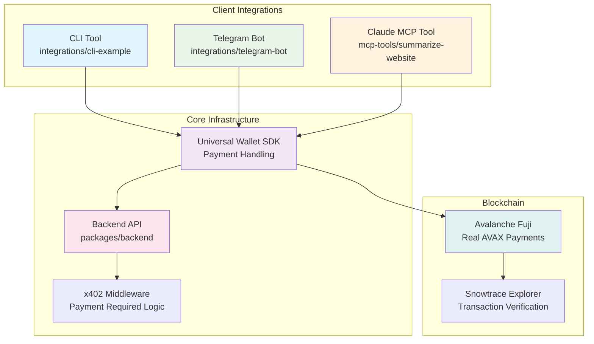
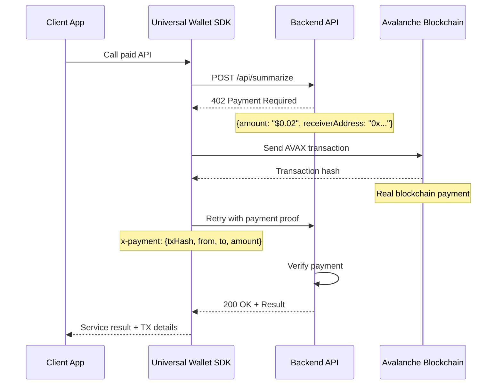
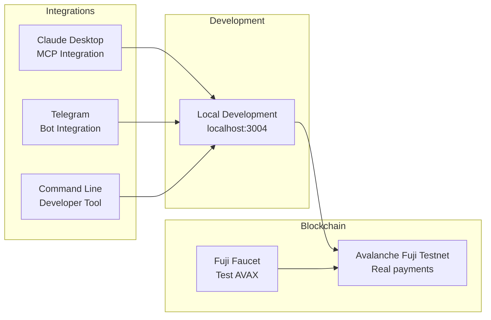

# Architecture Documentation

## Overview

Universal Agent Wallet implements the x402 (HTTP 402 Payment Required) protocol to enable seamless micropayments for AI agents and tools. The architecture consists of a backend API with x402 middleware, a Universal Wallet SDK, and multiple client integrations.

## System Architecture



## Payment Flow Sequence



## Component Details

### Backend API (`packages/backend`)

**Core Components:**
- **x402 Middleware** (`src/middleware/x402.ts`) - Handles payment validation and 402 responses
- **Summarizer Service** (`src/services/summarizer.ts`) - Demo AI service implementation
- **Universal Wallet SDK** (`src/sdk/UniversalWallet.ts`) - Server-side payment utilities

**Key Endpoints:**
- `POST /api/summarize` - Paid endpoint ($0.02 per request)
- `GET /api/info` - Service documentation
- `GET /api/health` - Health check

### Universal Wallet SDK

**Shared across all integrations:**
- **Payment Handling** - Automatic 402 response processing
- **Blockchain Integration** - Real AVAX transactions on Fuji testnet
- **Balance Management** - Check wallet status and sufficiency
- **Error Handling** - Comprehensive error messages and recovery

**Key Methods:**
```typescript
class UniversalWallet {
  getAddress(): string
  getBalance(): Promise<string>
  getWalletStatus(): Promise<WalletStatus>
  pay(to: string, amount: string): Promise<PaymentResult>
  createPaymentHeader(details: PaymentDetails): Promise<string>
}
```

### Client Integrations

#### 1. CLI Example (`integrations/cli-example`)
- **Purpose**: Developer demonstration tool
- **Usage**: `npm start -- https://example.com`
- **Features**: Step-by-step payment flow visualization

#### 2. Telegram Bot (`integrations/telegram-bot`)
- **Purpose**: Interactive chat interface
- **Commands**: `/start`, `/balance`, `/summarize <url>`
- **Features**: Real-time payment notifications

#### 3. Claude MCP Tool (`mcp-tools/summarize-website`)
- **Purpose**: Desktop AI integration
- **Usage**: "summarize https://example.com" in Claude
- **Features**: Seamless Claude Desktop integration

## x402 Protocol Implementation

### 1. Initial API Call
```http
POST /api/summarize
Content-Type: application/json

{"url": "https://example.com"}
```

### 2. Payment Required Response
```http
HTTP/1.1 402 Payment Required
Content-Type: application/json

{
  "status": "payment_required",
  "payment": {
    "amount": "$0.02",
    "currency": "AVAX",
    "receiverAddress": "0x78b15E52703DD697a021A2AA7F235A41C2279442",
    "network": "avalanche-fuji"
  }
}
```

### 3. Payment Execution
SDK automatically:
1. Converts USD to AVAX (demo rate: $50/AVAX)
2. Sends blockchain transaction
3. Waits for confirmation
4. Creates payment proof

### 4. Retry with Payment Proof
```http
POST /api/summarize
Content-Type: application/json
x-payment: {"txHash":"0x...","from":"0x...","to":"0x...","amount":"$0.02"}

{"url": "https://example.com"}
```

### 5. Success Response
```http
HTTP/1.1 200 OK
Content-Type: application/json

{
  "success": true,
  "data": {
    "summary": "Website content summary..."
  }
}
```

## Security Model

### Payment Verification
- **Real Blockchain Transactions** - All payments are actual AVAX transfers
- **Transaction Verification** - Backend can verify payments on-chain
- **Replay Protection** - Transaction hashes prevent replay attacks

### Private Key Management
- **Environment Variables** - Keys stored in `.env` files
- **Testnet Only** - Demo uses Avalanche Fuji testnet
- **No Frontend Exposure** - Private keys never sent to browsers

### Error Handling
- **Insufficient Balance** - Clear error messages with faucet links
- **Network Errors** - Retry logic and connection diagnostics
- **Invalid URLs** - Input validation and sanitization

## Deployment Architecture



## Getting Started

1. **Backend Setup**
   ```bash
   cd packages/backend
   npm run dev  # Starts on port 3004
   ```

2. **Choose Integration**
   - **CLI**: `cd integrations/cli-example && npm start -- <url>`
   - **Telegram**: Configure bot token and start
   - **Claude MCP**: Restart Claude Desktop

3. **Fund Wallet**
   - Get testnet AVAX from [Avalanche Fuji Faucet](https://faucet.avax.network/)
   - Add private key to integration's `.env` file

4. **Test Payment Flow**
   - Each integration demonstrates the complete x402 cycle
   - Real AVAX payments with Snowtrace verification links

## Technical Specifications

- **Blockchain**: Avalanche Fuji Testnet (Chain ID: 43113)
- **Payment Currency**: AVAX
- **Typical Cost**: $0.02 per API request
- **Gas Fees**: ~$0.001 (minimal on testnet)
- **Settlement Time**: 2-3 seconds
- **Protocol**: HTTP 402 Payment Required standard
